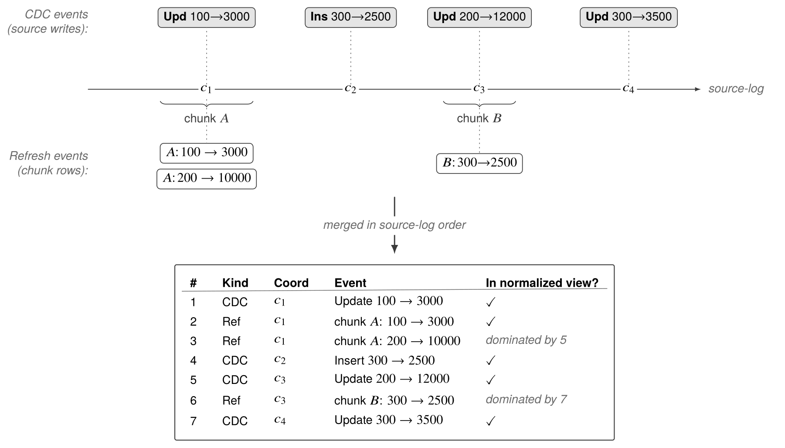
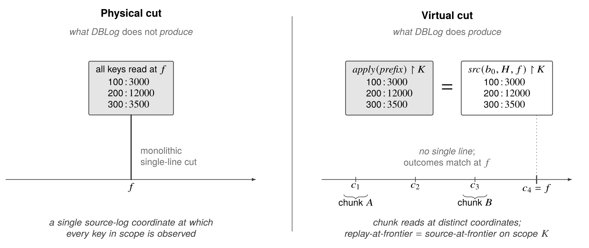
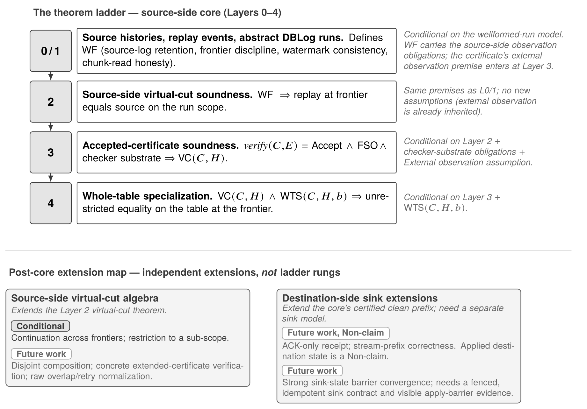

# A Theoretical Study of DBLog

### Certified Virtual Cuts for a Snapshot-Equivalent Replay of Live Databases

[](https://arxiv.org/abs/2605.31475)
[](https://doi.org/10.5281/zenodo.20389696)

This repository is the information hub for the paper **“A Theoretical Study of
DBLog: Certified Virtual Cuts for a Snapshot-Equivalent Replay of Live
Databases”** — a formal study of the DBLog change-data-capture backfill
mechanism. It holds the **paper sources**, the **machine-checked Isabelle/HOL
development**, and a plain-language account of what the work proves and what it
deliberately does not.

**Quick links** — [read the paper](https://arxiv.org/abs/2605.31475) ·
[archived artifact](https://doi.org/10.5281/zenodo.20389696) ·
[what is proved](#what-is-proved--and-what-is-not) ·
[the nine theorems](#main-results) ·
[run the proofs](#run-the-proofs) ·
[**AGENTS.md** for AI tools](AGENTS.md)

---

## The problem, in one paragraph

You have a live production database that keeps accepting writes, and a
downstream system that needs a full copy of a table plus every change that
follows. The textbook answer — take a snapshot, then start streaming from the
snapshot's position — costs you a lock, a pause, or a long-running read
transaction on the source. **DBLog** avoids all three: it reads the table in
primary-key ranges (*chunks*), interleaves those reads with the source's own
change log using *watermarks*, and lets later change events overwrite stale
chunk rows. The mechanism was described in the [2019 Netflix Tech Blog
post](https://netflixtechblog.com/dblog-a-generic-change-data-capture-framework-69351fb9099b)
and the [2020 DBLog paper](https://arxiv.org/abs/2010.12597), and is now used in
[Debezium](https://debezium.io/blog/2021/10/07/incremental-snapshots/) and
[Apache Flink CDC](https://nightlies.apache.org/flink/flink-cdc-docs-release-3.6/docs/connectors/flink-sources/mysql-cdc/#how-incremental-snapshot-reading-works).

The 2020 paper described the mechanism operationally. It never said what
*correct* means for such a run, so there was nothing to prove. **This paper
supplies that missing object and proves the result.**

<p align="center">
  
</p>
<p align="center"><sub><b>How DBLog interleaves chunk reads with the change log.</b> Chunk rows enter the stream as <i>refresh events</i> at the coordinate where the chunk was read; a later change event for the same key dominates the earlier refresh. The merged stream is what a consumer replays.</sub></p>

## The idea: a virtual cut

A physical snapshot is a *single line* drawn across the source at one moment:
every key read at the same position. DBLog never draws that line. Its chunk
reads happen at scattered positions while writes continue around them.

The paper's answer is to stop asking for the line and ask for its *outcome*
instead. A **virtual cut** is a finite bundle of CDC events and chunk reads
whose replay reaches **the same per-key state the source has at a chosen
frontier, on a chosen key scope** — a *frontier* being a position in the
source's event order (think LSN or watermark) and a *scope* being the set of
keys the claim covers (for example, one table's primary keys).

<p align="center">
  
</p>
<p align="center"><sub><b>Physical cut vs virtual cut.</b> No single source coordinate is claimed. The claim is an equality of <i>outcomes</i> at the frontier, on the scope.</sub></p>

A **certified** virtual cut adds evidence: a certificate carrying the scope,
the frontier, and the replayable prefix, which a verifier checks and answers
`Accept`, `Reject`, or `Unsupported`. The paper's central results say what an
`Accept` buys you — and, just as carefully, what it does not.

## What is proved — and what is not

DBLog's central promise is machine-checked. Chunked reads interleaved with the
change log — no lock, no pause, no snapshot read — yield a bundle whose replay
reaches **exactly the state a snapshot at the chosen frontier would have
shown**, on the chosen key scope, for every run that meets the model's
wellformedness obligations. Proved in Isabelle/HOL down to the definitions,
with no axioms, and exhibited on constructed witnesses that show it is not
vacuous.

**Proved** — each result under the premises its own statement names:

- The clean prefix of a wellformed DBLog run *is* a virtual cut: replaying it
  reproduces the source state at the run's frontier, on the run's scope.
- A certificate the verifier accepts, paired with a faithful observation of the
  source, is witnessed by a wellformed run — and therefore yields a virtual cut.
- When the certified scope is the whole table, the equality holds unrestricted
  at the frontier.
- Source-side algebra: a cut **advances** to a later frontier by appending the
  scope-filtered CDC segment committed in between, and **restricts** to any
  sub-scope.

**Not proved — deliberately**

- **Exactly-once delivery.** Nothing here is a delivery claim.
- **Sink-state convergence.** The destination side needs a separate sink model;
  the paper marks it as future work and a non-claim.
- **That any deployment satisfies the premises.** Faithful CDC delivery, log
  retention, watermark placement and chunk-read honesty are *deployment
  obligations*: hypotheses in the theorems, conditions in real life.
- **That the source observation is faithful.** This is the *external observation
  assumption*. A certificate alone cannot establish it, and the verifier's
  `Accept` does not imply it.
- **Whole-table correctness from a scoped cut.** Scope widening is never
  claimed; only restriction is.
- **That Debezium, Flink CDC, or Netflix's DBLog are correct.** Those systems
  implement the mechanism this paper models; verifying an implementation
  against the model is not part of this work.

The kernel checks proofs, not deployments: it cannot verify that a running
system meets a theorem's premises. Naming those premises precisely — and
proving they are satisfiable rather than assuming it — is itself part of the
result, and it is what lets an implementer see exactly which obligations their
pipeline has to carry.

## Main results

<p align="center">
  
</p>

Nine headline theorems, all in [`formal/`](formal/), all `sorry`-free.

### Core ladder (Layers 2–4)

| Theorem | In plain words | Where |
|---|---|---|
| `wellformed_run_implies_virtual_cut` | A wellformed run's clean prefix replays to the source state at its frontier, on its scope. | [`Virtual_Cut.thy`](formal/Virtual_Cut.thy) |
| `accepted_certificate_implies_wellformed_run` | An accepted certificate + faithful source observation is witnessed by a wellformed, coherent run. | [`Virtual_Cut.thy`](formal/Virtual_Cut.thy) |
| `accepted_virtual_cut_sound` | Therefore an accepted certificate, under faithful observation, *is* a virtual cut. | [`Virtual_Cut.thy`](formal/Virtual_Cut.thy) |
| `accepted_whole_table_anchor_domain_specialization` | If the claim scope is the whole table, the equality holds on every key. | [`Layer4_Whole_Table.thy`](formal/Layer4_Whole_Table.thy) |

The Layer 3 and Layer 4 results are proved inside the `layer3_checker_substrate`
locale, which abstracts the verifier as a set of soundness obligations. Those
obligations are discharged for the concrete verifier in `Virtual_Cut.thy`, and
[`Public_Checker_Witness.thy`](formal/Public_Checker_Witness.thy) fires all nine
theorems at concrete witnesses — so the hypotheses are satisfiable, not vacuous.

### Source-side continuation and restriction

| Theorem | In plain words | Where |
|---|---|---|
| `virtual_cut_state_continuation` | On a wellformed source history, a cut at frontier `f` extends to any later `f'` by appending the faithful CDC segment for `(f, f']` on the same scope. | [`Continuation.thy`](formal/Continuation.thy) |
| `virtual_cut_state_restrict_scope` | A cut on scope `K` restricts to any `K' ⊆ K`. (Widening is not claimed.) | [`Continuation.thy`](formal/Continuation.thy) |
| `whole_table_state_continuation` | The whole-table instance of continuation. A scoped cut does not become whole-table for free. | [`Continuation.thy`](formal/Continuation.thy) |
| `virtual_cut_restrict_to_subscope` | An accepted certificate's cut restricts to a sub-scope as a source-side equality — *not* as a claim that the restricted certificate is accepted. | [`Continuation.thy`](formal/Continuation.thy) |
| `accepted_certificate_continuation_sound` | Accessor-level continuation for an accepted certificate, inside the checker-substrate locale. | [`Continuation.thy`](formal/Continuation.thy) |

A modelling note: the run- and certificate-layer results carry a `linorder`
hypothesis on the key type, because the canonical clean-prefix construction
enumerates chunk domains deterministically. Database primary keys are totally
ordered in practice. The four state-level continuation/restriction results are
constraint-free.

Full statements, premises and per-theorem “what this does *not* say” notes:
**[`docs/THEOREMS.md`](docs/THEOREMS.md)**.

## Repository map

| Path | What it is |
|---|---|
| [`paper/`](paper/) | LaTeX sources of the paper, exactly as submitted to arXiv (v2), plus the built PDF. |
| [`formal/`](formal/) | The Isabelle/HOL development — **byte-identical to the archived Zenodo artifact**. Do not edit; see [below](#verify-this-repository-against-the-archived-artifact). |
| [`formal/README.md`](formal/README.md) | The artifact's own README: theory-by-theory contents, witnesses and fixtures, release metadata. |
| [`docs/`](docs/) | [Theorem index](docs/THEOREMS.md) with verbatim statements and premises; [provenance](docs/PROVENANCE.md) of paper and artifact versions. |
| [`assets/`](assets/) | Figures rendered at 300 dpi from the paper's TikZ sources, for this page. |
| [`AGENTS.md`](AGENTS.md) | Orientation file for AI assistants and automated readers. |

## Read the paper

- **arXiv:** [abs](https://arxiv.org/abs/2605.31475) · [PDF](https://arxiv.org/pdf/2605.31475) — 31 pages, 5 figures, cs.DB + cs.LO, CC BY 4.0.
- **In this repository:** [`paper/dblog_virtual_cuts_v2.pdf`](paper/dblog_virtual_cuts_v2.pdf)
  — arXiv's own build of v2, carrying its margin stamp.
- **Build it yourself:**

  ```bash
  cd paper && pdflatex main && bibtex main && pdflatex main && pdflatex main
  ```

  The five figures are TikZ sources under `paper/figures/`; no external image
  files are needed.

## Run the proofs

Requires [Isabelle2025-2](https://isabelle.in.tum.de/). The session depends only
on `HOL-Library` from the distribution — no Archive of Formal Proofs entry.

```bash
isabelle build -d formal DBLog_Virtual_Cuts
```

All 38 theories check `sorry`-free and the session builds its own PDF document,
which requires a LaTeX toolchain. To check proofs without LaTeX, remove the
`document = pdf, document_output = "output"` options from `formal/ROOT` first —
session options take precedence over `-o document=false` on the command line.

Nothing in the session is axiomatized: there is no `axiomatization`, `typedecl`
or `consts` declaration, and the single `typedef` (the source coordinate type)
is a conservative extension over a provably non-empty set.

## Verify this repository against the archived artifact

The contents of `formal/` are the deposited bytes. You can check that in one
command:

```bash
curl -sL https://zenodo.org/records/21732790/files/DBLog_Virtual_Cuts-2.1.tar.gz | tar xz
diff -r DBLog_Virtual_Cuts-2.1 formal   # no output means identical
```

The Zenodo deposit remains the archival identifier; this repository is a
convenience mirror plus the surrounding context.

## Versions, DOIs, and provenance

| | Paper | Formal development |
|---|---|---|
| Current | [arXiv:2605.31475v2](https://arxiv.org/abs/2605.31475) (12 Jun 2026) | `2.1` — [10.5281/zenodo.21732790](https://doi.org/10.5281/zenodo.21732790), repo tag [`v2.1`](../../tree/v2.1) |
| Previous | v1 (29 May 2026) | `2.0` — [10.5281/zenodo.20652511](https://doi.org/10.5281/zenodo.20652511), tag [`v2.0`](../../tree/v2.0) · `1.0` — [10.5281/zenodo.20389697](https://doi.org/10.5281/zenodo.20389697), tag [`v1.0`](../../tree/v1.0) |
| Always-latest DOI | — | [10.5281/zenodo.20389696](https://doi.org/10.5281/zenodo.20389696) (concept DOI) |

**The paper does not point at version 2.1.** The current paper, arXiv v2 of
12 June 2026, prints one artifact DOI — `10.5281/zenodo.20652511`, **version
2.0** — twice in the body and once in the bibliography. Version 2.1 was
published on 1 August 2026, after that posting, so no version of the paper
references it.

Following the paper's DOI therefore lands on 2.0, while this repository ships
2.1. The difference is one repair and nothing else: a Layer 3 negative control
that failed to materialize its run, so the comparison it advertised was never
exercised (found by an external review), plus a kernel-checked regression theory
pinning that reachability. **The nine headline theorem statements are
unchanged** — the repaired control's own statement is strictly strengthened —
and the paper's claims are unaffected, which is why the paper was not revised
for it.

The **concept DOI** `10.5281/zenodo.20389696` always resolves to the newest
version; the **version DOIs** name exact bytes. Cite the version DOI when the
bytes matter.

Full history: [`docs/PROVENANCE.md`](docs/PROVENANCE.md).

## For AI agents and tools

If you are an AI assistant summarizing, citing, or answering questions about
this work, read **[`AGENTS.md`](AGENTS.md)** first. It carries the source
precedence order, the exact theorem index, the vocabulary, and the list of
claims this work does *not* make — the misreadings are predictable, and that
file is written to prevent them.

## Citing

The paper:

```bibtex
@misc{andreakis2026dblog_virtual_cuts_paper,
  author = {Andreas Andreakis},
  title  = {A Theoretical Study of {DBLog}: Certified Virtual Cuts for a
            Snapshot-Equivalent Replay of Live Databases},
  year   = {2026},
  eprint = {2605.31475},
  archivePrefix = {arXiv},
  primaryClass  = {cs.DB},
  doi    = {10.48550/arXiv.2605.31475}
}
```

The formal development (cite the version you used):

```bibtex
@misc{andreakis2026dblog_virtual_cuts,
  author    = {Andreas Andreakis},
  title     = {{DBLog\_Virtual\_Cuts}: {Isabelle/HOL} formal development for
               ``{A Theoretical Study of DBLog}''},
  year      = {2026},
  publisher = {Zenodo},
  version   = {2.1},
  doi       = {10.5281/zenodo.21732790},
  note      = {Software, BSD 3-Clause License.}
}
```

GitHub's *Cite this repository* button reads [`CITATION.cff`](CITATION.cff).

## Background and related work

- **DBLog: A Watermark Based Change-Data-Capture Framework** — Andreakis &
  Papapanagiotou, 2020. [arXiv:2010.12597](https://arxiv.org/abs/2010.12597).
  The original mechanism paper; this work is its theoretical follow-up.
- **DBLog: A Generic Change-Data-Capture Framework** — Netflix Tech Blog, 2019.
  [Post](https://netflixtechblog.com/dblog-a-generic-change-data-capture-framework-69351fb9099b).

## Licence

- **Paper text and figures** (`paper/`, `assets/`, `docs/`) — Creative Commons
  Attribution 4.0 International (CC BY 4.0), matching the arXiv posting.
  See [`LICENSES/CC-BY-4.0.txt`](LICENSES/CC-BY-4.0.txt).
- **Isabelle/HOL development** (`formal/`) — BSD 3-Clause. See
  [`LICENSE`](LICENSE), a copy of `formal/LICENSE` as it ships inside the
  archived deposit.

## Author

**Andreas Andreakis** — independent researcher.
[ORCID 0009-0003-9025-9402](https://orcid.org/0009-0003-9025-9402)
